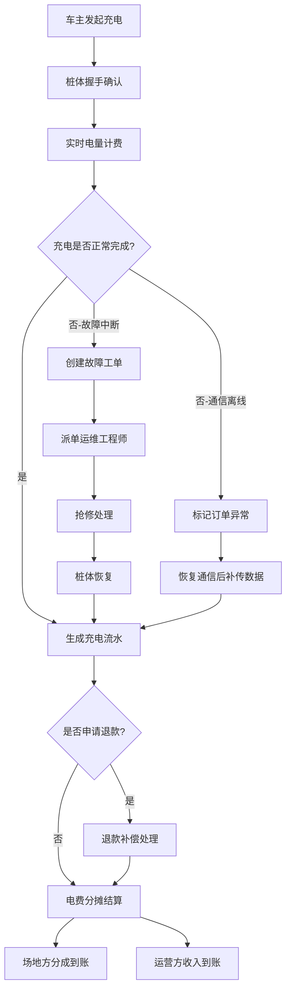
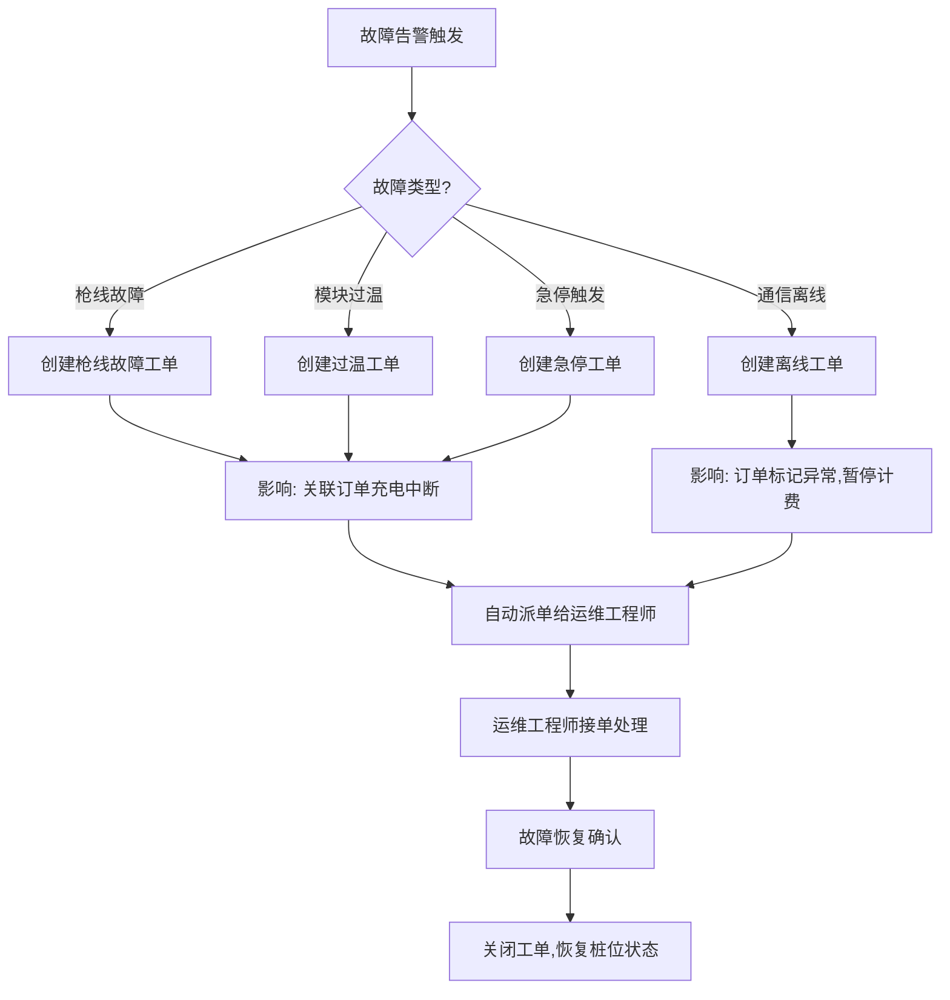
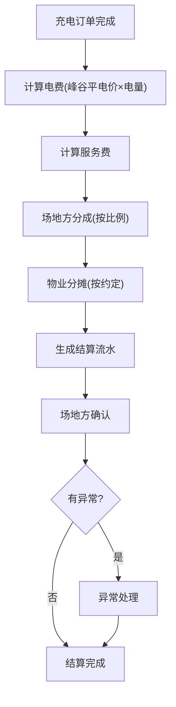
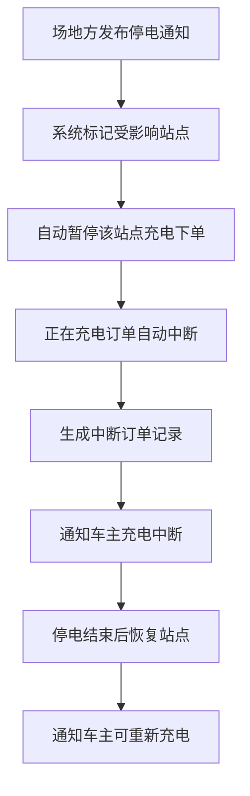

## 1. 产品概述

充电站管理平台是一个面向充电站运营方、运维工程师、车主和场地多方角色的综合管理系统。平台将充电下单、桩体握手、电量计费、故障中断、抢修派单、退款补偿和电费分摊连成完整闭环，实现充电站运营的数字化、自动化和透明化。

- 解决充电站多角色协同管理难题，消除信息孤岛
- 实现从充电下单到电费分摊的全流程闭环追踪

## 2. 核心功能

### 2.1 用户角色

| 角色 | 注册方式 | 核心权限 |
|------|----------|----------|
| 运营方 | 后台分配账号 | 维护站点、桩位、功率、电价规则、场地方分成 |
| 运维工程师 | 后台分配账号 | 处理枪线故障、模块过温、通信离线、急停恢复 |
| 车主 | 手机号注册 | 发起充电、查看排队、申请退款 |
| 场地方 | 后台分配账号 | 确认用电总表、物业分摊、停电通知 |

### 2.2 功能模块

1. **站点地图页**：充电站地图展示、站点搜索筛选、实时桩位状态总览
2. **充电桩状态页**：桩位实时监控、充电中的订单详情、桩体通信状态
3. **故障派单页**：故障工单列表、派单处理、抢修进度跟踪
4. **费用分摊页**：电费结算明细、场地方分成、物业分摊统计
5. **充电下单页**（车主）：扫码/选桩充电、实时电价、排队等候
6. **订单管理页**：充电流水记录、订单状态追踪、退款处理
7. **站点管理页**（运营方）：站点CRUD、桩位配置、电价规则、场地方分成设置
8. **运维工作台**（运维工程师）：故障告警、工单处理、设备巡检
9. **场地方门户**（场地方）：用电总表确认、分摊账单、停电通知

### 2.3 页面详情

| 页面名称 | 模块名称 | 功能描述 |
|----------|----------|----------|
| 站点地图页 | 地图展示 | 在地图上展示所有充电站位置和桩位空闲/占用/故障状态 |
| 站点地图页 | 站点搜索 | 按区域、站点名称、桩位类型筛选站点 |
| 站点地图页 | 快速充电入口 | 点击站点后可直接发起充电下单 |
| 充电桩状态页 | 实时监控面板 | 展示所有桩位实时状态（空闲/充电中/故障/离线） |
| 充电桩状态页 | 充电订单详情 | 查看充电中订单的电流、电压、已充电量、费用 |
| 充电桩状态页 | 通信状态监测 | 桩体通信在线/离线状态及历史记录 |
| 故障派单页 | 告警列表 | 实时故障告警（枪线故障、模块过温、通信离线、急停触发） |
| 故障派单页 | 工单派发 | 将故障工单派给运维工程师，设置优先级和处理时限 |
| 故障派单页 | 抢修进度 | 跟踪工单处理进度（已派单→处理中→已恢复→已关闭） |
| 费用分摊页 | 结算流水 | 充电订单的电费、服务费结算明细 |
| 费用分摊页 | 场地方分成 | 按场地方汇总分成金额和明细 |
| 费用分摊页 | 物业分摊 | 物业电费分摊统计和确认 |
| 充电下单页 | 选桩充电 | 车主选择空闲桩位发起充电请求 |
| 充电下单页 | 实时电价 | 展示当前时段电价（峰/平/谷） |
| 充电下单页 | 排队等候 | 查看当前桩位排队人数和预估等待时间 |
| 订单管理页 | 充电流水 | 所有充电订单的完整记录和时间线 |
| 订单管理页 | 退款处理 | 车主退款申请审核和处理 |
| 订单管理页 | 异常标记 | 通信离线、充电中断、账单异常自动标记 |
| 站点管理页 | 站点CRUD | 新增/编辑/删除充电站点信息 |
| 站点管理页 | 桩位配置 | 配置桩位功率、接口类型、计费方式 |
| 站点管理页 | 电价规则 | 设置峰谷平时段电价和阶梯电价 |
| 站点管理页 | 分成设置 | 配置场地方分成比例和结算周期 |
| 运维工作台 | 设备巡检 | 桩体定期巡检记录和计划 |
| 运维工作台 | 急停恢复 | 急停触发后的恢复操作流程 |
| 场地方门户 | 用电总表 | 确认和核对场站用电总量和峰谷分布 |
| 场地方门户 | 停电通知 | 发布和查看计划停电通知，自动影响关联订单 |

## 3. 核心流程

### 3.1 充电全流程闭环

用户通过平台完成从充电下单到电费分摊的完整流程：

1. 车主选择空闲桩位，发起充电请求
2. 平台向桩体发送握手指令，桩体确认连接后开始充电
3. 充电过程中实时计量电量和费用
4. 充电完成或异常中断时生成本次充电流水
5. 若发生故障，系统自动创建故障工单并派发给运维工程师
6. 运维工程师处理故障后恢复桩体
7. 如需退款，车主申请退款，运营方审核后执行退款补偿
8. 系统按电价规则和分成比例进行电费分摊结算

### 3.2 故障处理流程

### 3.3 电费分摊结算流程

### 3.4 停电通知影响流程

## 4. 用户界面设计

### 4.1 设计风格

- 主色调：深青色 (#0F766E) + 琥珀色强调 (#F59E0B)
- 按钮风格：圆角按钮，主操作用实心填充，次要操作用描边
- 字体：标题使用 Noto Sans SC Bold，正文使用 Noto Sans SC Regular
- 布局风格：左侧导航栏 + 右侧内容区，顶部用户信息栏
- 图标风格：线性图标（Lucide Icons），统一2px描边
- 数据可视化：使用图表展示电费、充电量等统计数据

### 4.2 页面设计概览

| 页面名称 | 模块名称 | UI元素 |
|----------|----------|--------|
| 站点地图页 | 地图展示 | 全屏地图，站点标记点带状态色标（绿-空闲/蓝-充电中/红-故障/灰-离线） |
| 站点地图页 | 站点信息弹窗 | 卡片式弹窗，展示站点名称、桩位数量、空闲数、实时电价 |
| 站点地图页 | 筛选面板 | 左侧可收起面板，区域/类型/状态筛选 |
| 充电桩状态页 | 监控面板 | 网格布局桩位卡片，每个卡片显示桩号、状态、功率、充电时长 |
| 充电桩状态页 | 订单详情 | 右侧抽屉，展示充电中的实时数据（电流/电压/电量/费用曲线） |
| 故障派单页 | 告警列表 | 表格布局，红/橙/黄三色告警级别标识 |
| 故障派单页 | 派单表单 | 模态弹窗，选择工程师、设置优先级和时限 |
| 费用分摊页 | 结算概览 | 顶部统计卡片（总电费/场地方分成/运营方收入） |
| 费用分摊页 | 分摊明细 | 表格布局，支持按月/周/日筛选，导出Excel |
| 充电下单页 | 选桩界面 | 桩位网格图，空闲桩位高亮可点击 |
| 充电下单页 | 充电进度 | 全屏充电状态面板，实时显示电量和费用 |
| 订单管理页 | 订单列表 | 可筛选表格，订单状态用标签色标识 |
| 站点管理页 | 表单编辑 | 分步表单，站点信息→桩位配置→电价规则→分成设置 |

### 4.3 响应式设计

- 桌面优先设计，支持1920px/1440px/1280px三个断点
- 移动端适配车主端核心功能（充电下单、查看排队、申请退款）
- 运维工作台和站点管理主要面向桌面端

### 4.4 角色视图区分

- **运营方**：完整管理视图，包含所有功能模块
- **运维工程师**：运维工作台为主，专注故障处理和设备状态
- **车主**：简化视图，专注充电下单、订单查询和退款
- **场地方**：财务视图，专注分摊账单和停电通知
