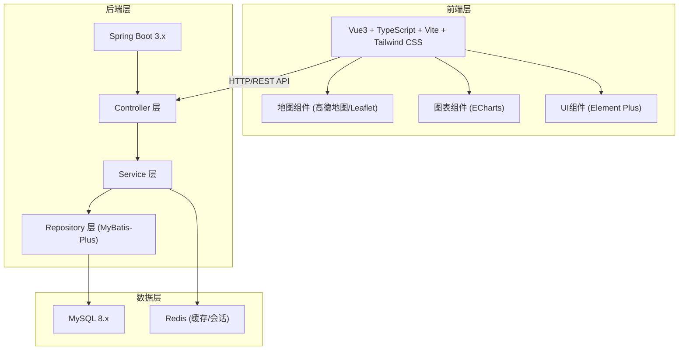
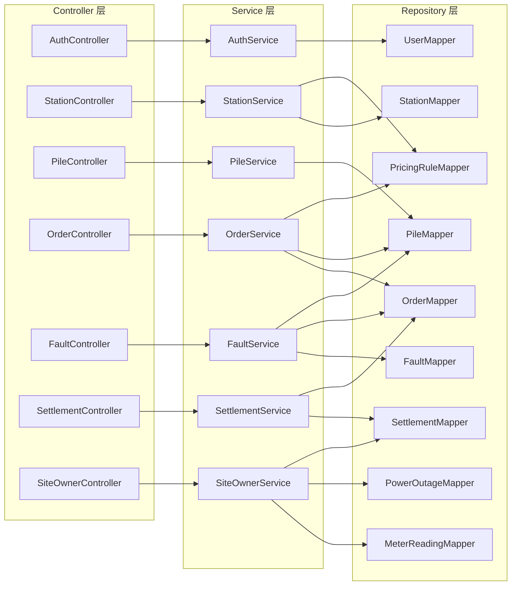
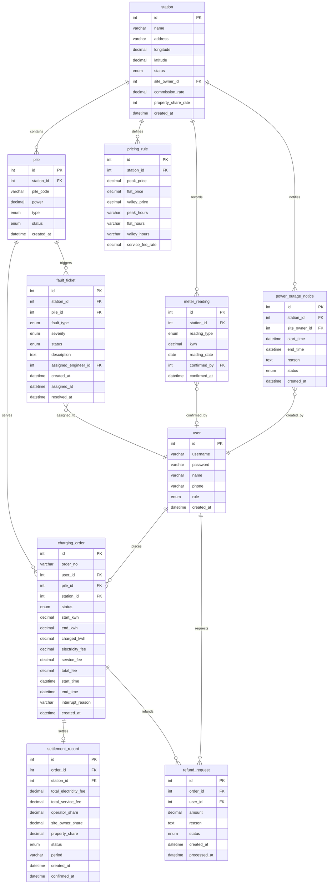

## 1. 架构设计



## 2. 技术说明

- 前端：Vue3 + TypeScript + Vite + Tailwind CSS + Element Plus + ECharts + Leaflet
- 初始化工具：Vite
- 后端：Spring Boot 3.x + MyBatis-Plus + Spring Security + JWT
- 数据库：MySQL 8.x + Redis 7.x
- 项目结构：前后端分离，frontend/ 和 backend/ 两个子目录

## 3. 路由定义

| 路由 | 用途 | 访问角色 |
|------|------|----------|
| /login | 登录页面 | 全部 |
| /dashboard | 仪表盘概览 | 运营方/运维工程师 |
| /map | 站点地图 | 全部 |
| /stations | 站点管理 | 运营方 |
| /stations/:id | 站点详情/编辑 | 运营方 |
| /piles | 充电桩状态监控 | 运营方/运维工程师 |
| /charging | 充电下单 | 车主 |
| /charging/:id | 充电进行中 | 车主 |
| /orders | 订单管理 | 运营方/车主 |
| /faults | 故障派单 | 运营方/运维工程师 |
| /settlement | 费用分摊/结算 | 运营方/场地方 |
| /site-owner | 场地方门户 | 场地方 |
| /profile | 个人信息 | 全部 |

## 4. API 定义

### 4.1 认证相关

```typescript
interface LoginRequest {
  username: string
  password: string
}

interface LoginResponse {
  token: string
  user: {
    id: number
    username: string
    role: "OPERATOR" | "ENGINEER" | "CAR_OWNER" | "SITE_OWNER"
    name: string
  }
}
```

### 4.2 站点相关

```typescript
interface Station {
  id: number
  name: string
  address: string
  longitude: number
  latitude: number
  totalPiles: number
  availablePiles: number
  status: "ACTIVE" | "INACTIVE" | "MAINTENANCE"
  siteOwnerId: number
  siteOwnerName: string
  commissionRate: number
  createdAt: string
}

interface Pile {
  id: number
  stationId: number
  pileCode: string
  power: number
  type: "DC_FAST" | "DC_SLOW" | "AC_SLOW"
  status: "IDLE" | "CHARGING" | "FAULT" | "OFFLINE" | "EMERGENCY_STOP"
  currentOrder?: ChargingOrder
}

interface PricingRule {
  id: number
  stationId: number
  peakPrice: number
  flatPrice: number
  valleyPrice: number
  peakHours: string
  flatHours: string
  valleyHours: string
  serviceFeeRate: number
}
```

### 4.3 充电订单相关

```typescript
interface ChargingOrder {
  id: number
  orderNo: string
  userId: number
  pileId: number
  stationId: number
  status: "PENDING" | "HANDSHAKE" | "CHARGING" | "COMPLETED" | "INTERRUPTED" | "FAULT_INTERRUPT" | "REFUNDING" | "REFUNDED" | "OFFLINE_INTERRUPT"
  startKwh: number
  endKwh: number
  chargedKwh: number
  electricityFee: number
  serviceFee: number
  totalFee: number
  startTime: string
  endTime?: string
  interruptReason?: string
}

interface RefundRequest {
  orderId: number
  reason: string
  amount: number
}
```

### 4.4 故障工单相关

```typescript
interface FaultTicket {
  id: number
  stationId: number
  pileId: number
  faultType: "GUN_LINE_FAULT" | "MODULE_OVER_TEMP" | "COMM_OFFLINE" | "EMERGENCY_STOP"
  severity: "CRITICAL" | "HIGH" | "MEDIUM" | "LOW"
  status: "PENDING" | "ASSIGNED" | "PROCESSING" | "RESOLVED" | "CLOSED"
  description: string
  assignedEngineerId?: number
  assignedEngineerName?: string
  createdAt: string
  assignedAt?: string
  resolvedAt?: string
  affectedOrderIds: number[]
}
```

### 4.5 结算相关

```typescript
interface SettlementRecord {
  id: number
  orderId: number
  stationId: number
  totalElectricityFee: number
  totalServiceFee: number
  operatorShare: number
  siteOwnerShare: number
  propertyShare: number
  status: "PENDING" | "CONFIRMED" | "DISPUTED" | "SETTLED"
  period: string
  createdAt: string
  confirmedAt?: string
}

interface MeterReading {
  id: number
  stationId: number
  readingType: "TOTAL" | "PROPERTY"
  kwh: number
  readingDate: string
  confirmedBy?: number
  confirmedAt?: string
}

interface PowerOutageNotice {
  id: number
  stationId: number
  siteOwnerId: number
  startTime: string
  endTime: string
  reason: string
  status: "SCHEDULED" | "ACTIVE" | "COMPLETED" | "CANCELLED"
  affectedOrderIds: number[]
}
```

## 5. 服务端架构图



## 6. 数据模型

### 6.1 数据模型定义



### 6.2 数据定义语言

```sql
CREATE DATABASE IF NOT EXISTS charging_station DEFAULT CHARACTER SET utf8mb4 COLLATE utf8mb4_unicode_ci;

USE charging_station;

CREATE TABLE `user` (
  `id` BIGINT NOT NULL AUTO_INCREMENT,
  `username` VARCHAR(64) NOT NULL,
  `password` VARCHAR(256) NOT NULL,
  `name` VARCHAR(64) NOT NULL,
  `phone` VARCHAR(20),
  `role` ENUM('OPERATOR','ENGINEER','CAR_OWNER','SITE_OWNER') NOT NULL,
  `created_at` DATETIME NOT NULL DEFAULT CURRENT_TIMESTAMP,
  `updated_at` DATETIME NOT NULL DEFAULT CURRENT_TIMESTAMP ON UPDATE CURRENT_TIMESTAMP,
  PRIMARY KEY (`id`),
  UNIQUE KEY `uk_username` (`username`)
) ENGINE=InnoDB;

CREATE TABLE `station` (
  `id` BIGINT NOT NULL AUTO_INCREMENT,
  `name` VARCHAR(128) NOT NULL,
  `address` VARCHAR(256) NOT NULL,
  `longitude` DECIMAL(10,7) NOT NULL,
  `latitude` DECIMAL(10,7) NOT NULL,
  `status` ENUM('ACTIVE','INACTIVE','MAINTENANCE') NOT NULL DEFAULT 'ACTIVE',
  `site_owner_id` BIGINT,
  `commission_rate` DECIMAL(5,2) NOT NULL DEFAULT 0.00 COMMENT '场地方分成比例(%)',
  `property_share_rate` DECIMAL(5,2) NOT NULL DEFAULT 0.00 COMMENT '物业分摊比例(%)',
  `created_at` DATETIME NOT NULL DEFAULT CURRENT_TIMESTAMP,
  `updated_at` DATETIME NOT NULL DEFAULT CURRENT_TIMESTAMP ON UPDATE CURRENT_TIMESTAMP,
  PRIMARY KEY (`id`),
  KEY `idx_site_owner` (`site_owner_id`)
) ENGINE=InnoDB;

CREATE TABLE `pile` (
  `id` BIGINT NOT NULL AUTO_INCREMENT,
  `station_id` BIGINT NOT NULL,
  `pile_code` VARCHAR(32) NOT NULL,
  `power` DECIMAL(8,2) NOT NULL COMMENT '额定功率(kW)',
  `type` ENUM('DC_FAST','DC_SLOW','AC_SLOW') NOT NULL,
  `status` ENUM('IDLE','CHARGING','FAULT','OFFLINE','EMERGENCY_STOP') NOT NULL DEFAULT 'IDLE',
  `created_at` DATETIME NOT NULL DEFAULT CURRENT_TIMESTAMP,
  `updated_at` DATETIME NOT NULL DEFAULT CURRENT_TIMESTAMP ON UPDATE CURRENT_TIMESTAMP,
  PRIMARY KEY (`id`),
  UNIQUE KEY `uk_pile_code` (`pile_code`),
  KEY `idx_station` (`station_id`)
) ENGINE=InnoDB;

CREATE TABLE `pricing_rule` (
  `id` BIGINT NOT NULL AUTO_INCREMENT,
  `station_id` BIGINT NOT NULL,
  `peak_price` DECIMAL(8,4) NOT NULL COMMENT '峰时电价(元/kWh)',
  `flat_price` DECIMAL(8,4) NOT NULL COMMENT '平时电价(元/kWh)',
  `valley_price` DECIMAL(8,4) NOT NULL COMMENT '谷时电价(元/kWh)',
  `peak_hours` VARCHAR(128) NOT NULL COMMENT '峰时时段,如 08:00-11:00,18:00-21:00',
  `flat_hours` VARCHAR(128) NOT NULL COMMENT '平时时段',
  `valley_hours` VARCHAR(128) NOT NULL COMMENT '谷时时段',
  `service_fee_rate` DECIMAL(5,2) NOT NULL DEFAULT 0.00 COMMENT '服务费率(%)',
  `created_at` DATETIME NOT NULL DEFAULT CURRENT_TIMESTAMP,
  `updated_at` DATETIME NOT NULL DEFAULT CURRENT_TIMESTAMP ON UPDATE CURRENT_TIMESTAMP,
  PRIMARY KEY (`id`),
  KEY `idx_station` (`station_id`)
) ENGINE=InnoDB;

CREATE TABLE `charging_order` (
  `id` BIGINT NOT NULL AUTO_INCREMENT,
  `order_no` VARCHAR(32) NOT NULL,
  `user_id` BIGINT NOT NULL,
  `pile_id` BIGINT NOT NULL,
  `station_id` BIGINT NOT NULL,
  `status` ENUM('PENDING','HANDSHAKE','CHARGING','COMPLETED','INTERRUPTED','FAULT_INTERRUPT','REFUNDING','REFUNDED','OFFLINE_INTERRUPT') NOT NULL DEFAULT 'PENDING',
  `start_kwh` DECIMAL(10,4) NOT NULL DEFAULT 0.0000,
  `end_kwh` DECIMAL(10,4) NOT NULL DEFAULT 0.0000,
  `charged_kwh` DECIMAL(10,4) NOT NULL DEFAULT 0.0000,
  `electricity_fee` DECIMAL(10,2) NOT NULL DEFAULT 0.00,
  `service_fee` DECIMAL(10,2) NOT NULL DEFAULT 0.00,
  `total_fee` DECIMAL(10,2) NOT NULL DEFAULT 0.00,
  `start_time` DATETIME,
  `end_time` DATETIME,
  `interrupt_reason` VARCHAR(256),
  `created_at` DATETIME NOT NULL DEFAULT CURRENT_TIMESTAMP,
  `updated_at` DATETIME NOT NULL DEFAULT CURRENT_TIMESTAMP ON UPDATE CURRENT_TIMESTAMP,
  PRIMARY KEY (`id`),
  UNIQUE KEY `uk_order_no` (`order_no`),
  KEY `idx_user` (`user_id`),
  KEY `idx_pile` (`pile_id`),
  KEY `idx_station` (`station_id`),
  KEY `idx_status` (`status`)
) ENGINE=InnoDB;

CREATE TABLE `fault_ticket` (
  `id` BIGINT NOT NULL AUTO_INCREMENT,
  `station_id` BIGINT NOT NULL,
  `pile_id` BIGINT NOT NULL,
  `fault_type` ENUM('GUN_LINE_FAULT','MODULE_OVER_TEMP','COMM_OFFLINE','EMERGENCY_STOP') NOT NULL,
  `severity` ENUM('CRITICAL','HIGH','MEDIUM','LOW') NOT NULL DEFAULT 'MEDIUM',
  `status` ENUM('PENDING','ASSIGNED','PROCESSING','RESOLVED','CLOSED') NOT NULL DEFAULT 'PENDING',
  `description` TEXT,
  `assigned_engineer_id` BIGINT,
  `created_at` DATETIME NOT NULL DEFAULT CURRENT_TIMESTAMP,
  `assigned_at` DATETIME,
  `resolved_at` DATETIME,
  `updated_at` DATETIME NOT NULL DEFAULT CURRENT_TIMESTAMP ON UPDATE CURRENT_TIMESTAMP,
  PRIMARY KEY (`id`),
  KEY `idx_station` (`station_id`),
  KEY `idx_pile` (`pile_id`),
  KEY `idx_engineer` (`assigned_engineer_id`),
  KEY `idx_status` (`status`)
) ENGINE=InnoDB;

CREATE TABLE `settlement_record` (
  `id` BIGINT NOT NULL AUTO_INCREMENT,
  `order_id` BIGINT NOT NULL,
  `station_id` BIGINT NOT NULL,
  `total_electricity_fee` DECIMAL(10,2) NOT NULL,
  `total_service_fee` DECIMAL(10,2) NOT NULL,
  `operator_share` DECIMAL(10,2) NOT NULL,
  `site_owner_share` DECIMAL(10,2) NOT NULL,
  `property_share` DECIMAL(10,2) NOT NULL,
  `status` ENUM('PENDING','CONFIRMED','DISPUTED','SETTLED') NOT NULL DEFAULT 'PENDING',
  `period` VARCHAR(20) NOT NULL COMMENT '结算周期,如 2026-06',
  `created_at` DATETIME NOT NULL DEFAULT CURRENT_TIMESTAMP,
  `confirmed_at` DATETIME,
  `updated_at` DATETIME NOT NULL DEFAULT CURRENT_TIMESTAMP ON UPDATE CURRENT_TIMESTAMP,
  PRIMARY KEY (`id`),
  KEY `idx_order` (`order_id`),
  KEY `idx_station` (`station_id`),
  KEY `idx_period` (`period`)
) ENGINE=InnoDB;

CREATE TABLE `meter_reading` (
  `id` BIGINT NOT NULL AUTO_INCREMENT,
  `station_id` BIGINT NOT NULL,
  `reading_type` ENUM('TOTAL','PROPERTY') NOT NULL COMMENT 'TOTAL=用电总表,PROPERTY=物业分表',
  `kwh` DECIMAL(12,4) NOT NULL,
  `reading_date` DATE NOT NULL,
  `confirmed_by` BIGINT,
  `confirmed_at` DATETIME,
  `created_at` DATETIME NOT NULL DEFAULT CURRENT_TIMESTAMP,
  PRIMARY KEY (`id`),
  KEY `idx_station_date` (`station_id`, `reading_date`)
) ENGINE=InnoDB;

CREATE TABLE `power_outage_notice` (
  `id` BIGINT NOT NULL AUTO_INCREMENT,
  `station_id` BIGINT NOT NULL,
  `site_owner_id` BIGINT NOT NULL,
  `start_time` DATETIME NOT NULL,
  `end_time` DATETIME NOT NULL,
  `reason` TEXT NOT NULL,
  `status` ENUM('SCHEDULED','ACTIVE','COMPLETED','CANCELLED') NOT NULL DEFAULT 'SCHEDULED',
  `created_at` DATETIME NOT NULL DEFAULT CURRENT_TIMESTAMP,
  `updated_at` DATETIME NOT NULL DEFAULT CURRENT_TIMESTAMP ON UPDATE CURRENT_TIMESTAMP,
  PRIMARY KEY (`id`),
  KEY `idx_station` (`station_id`),
  KEY `idx_status` (`status`)
) ENGINE=InnoDB;

CREATE TABLE `refund_request` (
  `id` BIGINT NOT NULL AUTO_INCREMENT,
  `order_id` BIGINT NOT NULL,
  `user_id` BIGINT NOT NULL,
  `amount` DECIMAL(10,2) NOT NULL,
  `reason` TEXT NOT NULL,
  `status` ENUM('PENDING','APPROVED','REJECTED','COMPLETED') NOT NULL DEFAULT 'PENDING',
  `processed_by` BIGINT,
  `created_at` DATETIME NOT NULL DEFAULT CURRENT_TIMESTAMP,
  `processed_at` DATETIME,
  `updated_at` DATETIME NOT NULL DEFAULT CURRENT_TIMESTAMP ON UPDATE CURRENT_TIMESTAMP,
  PRIMARY KEY (`id`),
  KEY `idx_order` (`order_id`),
  KEY `idx_user` (`user_id`),
  KEY `idx_status` (`status`)
) ENGINE=InnoDB;
```
